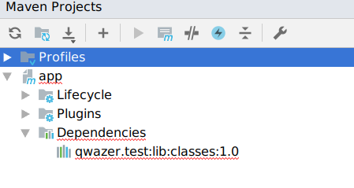

Sample project to demonstrate bug in idea.


1. Open project with IDEA
2. Setup maven to use provided maven-settings.xml
3. See that IDEA shows lib dependency as red
 

 
 
Files description
-----------------

```
mvn_deploy.sh
lib-1.0.pom.xml
lib-1.0.jar
```
files to create .m2_repo

```
maven-settings.xml
```
maven repo setup

 